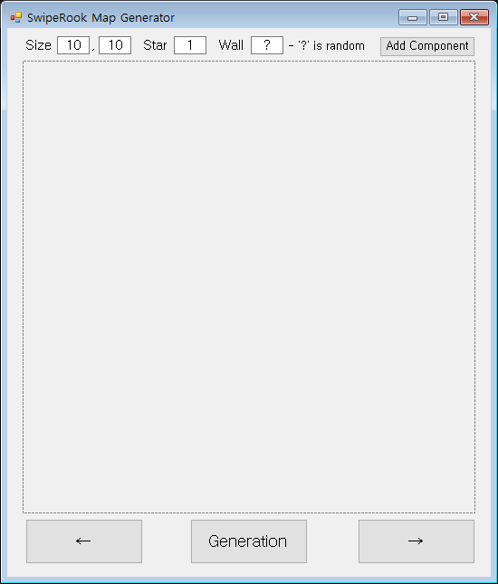
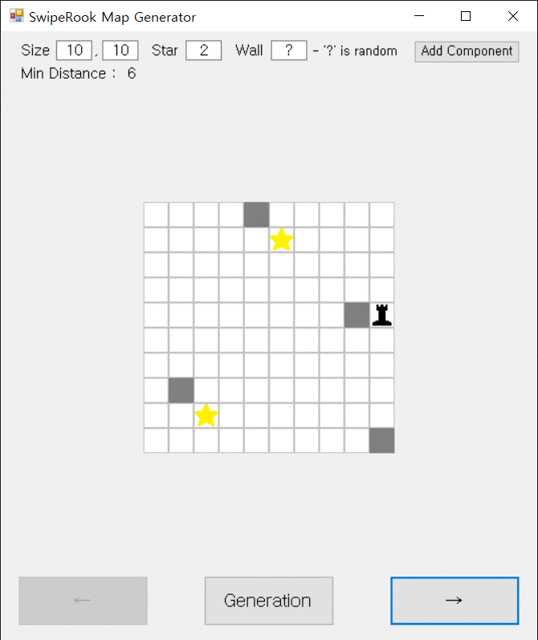

<h2><b>SwipeRook 맵 생성 프로그램</b></h2>
개발 환경
<li>C# Window Forms in Visual Studio 2019</li> 

 <h3><b>메인 화면</b></h3>
 

 <h3><b>실행 화면</b></h3>
 

<h3><b>작동 방식</b></h3>
1. Size, Star, Wall, MinDistance를 바탕으로 랜덤 맵을 생성 
2. BFS로 맵이 정상적인지 검사 
3. 정상적이라면 최단 경로 탐색 시작, 정상적이지 않다면 1번으로 이동 
4. DFS로 탐색 시작. 만약 별을 발견했다면 방문을 초기화하고 새롭게 DFS 시작. 모든 경로에 같은 방식을 취함 
5. 모든 경로를 탐색했다면 가장 거리가 짧은 경로 하나만 반환 
6. 얻은 최단 경로를 바탕으로 비트맵 생성    
